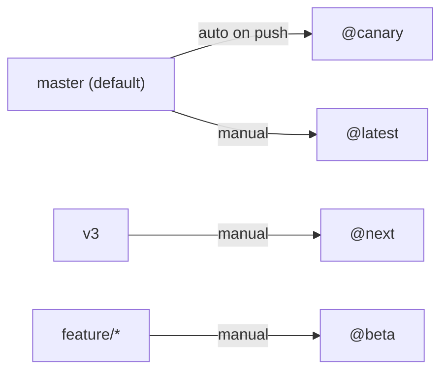

# Release Workflows

**TL;DR:** `master` is the default branch. Every push auto-publishes a `@canary` prerelease; stable releases are manually promoted from `master`. `v3` is a long-lived feature branch for v3-only (breaking) work; v3 prereleases (`@next`) are published manually via `workflow_dispatch`. Beta and preview paths are unchanged.

## Branch model

| Branch   | Role                                       | Default? | PR target for                      |
| -------- | ------------------------------------------ | -------- | ---------------------------------- |
| `master` | v2 active development, `@canary`/`@latest` | Yes      | All work (features, fixes, chores) |
| `v3`     | v3 breaking changes, `@next` (manual)      | No       | v3-only breaking changes           |



`v3` is kept in sync with `master` by periodic manual merge (no automation):

```bash
git switch v3 && git pull --ff-only
git merge master   # merge commit, NOT rebase
# resolve conflicts, favor v3 for breaking-change code paths
git push origin v3
```

## Release types

All packages share a single version (fixed versioning).

| Type        | Trigger     | Branch      | npm tag  | Version          | Script              |
| ----------- | ----------- | ----------- | -------- | ---------------- | ------------------- |
| **Canary**  | Auto (push) | `master`    | `canary` | `2.x.x-canary.X` | `release-canary.ts` |
| **Stable**  | Manual      | `master`    | `latest` | `2.x.x`          | `release-stable.ts` |
| **Next**    | Manual      | `v3`        | `next`   | `3.0.0-next.X`   | `release-canary.ts` |
| **Beta**    | Manual      | `feature/*` | `beta`   | `x.x.x-beta.X`   | `release-beta.ts`   |
| **Preview** | Auto (PR)   | any         | -        | -                | pkg.pr.new          |

### Canary (auto)

Every push to `master` runs `publish.yml` and publishes a canary if there are conventional commits since the last stable tag:

| Commit type                  | Bump  |
| ---------------------------- | ----- |
| `fix:`                       | patch |
| `feat:`                      | minor |
| `feat!:` / `BREAKING CHANGE` | major |

Skipped if no conventional commits are detected. Install: `npm install @supabase/supabase-js@canary`.

### Stable, Next, Beta (manual)

All three are paths inside `publish.yml`'s `workflow_dispatch`. Trigger from **Actions → Publish releases → Run workflow**, select the branch, fill exactly one input, leave the others empty:

| Path   | Branch      | Input to fill                                           |
| ------ | ----------- | ------------------------------------------------------- |
| Stable | `master`    | `version_specifier` (e.g. `patch`, `minor`, `v2.105.0`) |
| Next   | `v3`        | check `next_prerelease`                                 |
| Beta   | `feature/*` | `beta_version` (e.g. `2.105.0-beta.0`)                  |

Restricted to `@supabase/admin` or `@supabase/sdk` team members. Each path posts to Slack on success/failure.

The Next path reads `.next-base-version` (currently `3.0.0`) and auto-computes the next `-next.X` suffix. The GitHub release is auto-marked as a prerelease (nx detects the semver prerelease identifier); npm dist-tag is `next`, **not** `latest`.

```bash
npm install @supabase/supabase-js@next   # v3 prerelease
npm install @supabase/supabase-js@beta   # beta from a feature branch
```

### Preview (PR-based)

Every PR that touches `packages/core/**` auto-publishes via [pkg.pr.new](https://pkg.pr.new) (`preview-release.yml`). No label needed.

```bash
npm install https://pkg.pr.new/@supabase/supabase-js@[commit-hash]
```

## Common flows

**Non-breaking fix or feature:** PR → `master` → canary auto-publishes → trigger Stable when ready → optionally merge `master` into `v3` to bring the change forward.

**v3-only breaking change:** PR → `v3` (no auto-publish) → manually trigger Next when a prerelease is needed for dogfooding.

**Emergency v2 fix:** PR → `master` → trigger Stable with `patch` → merge `master` into `v3` so it carries forward.

**v3 ships:** PR `v3` → `master` (merge commit), then trigger Stable with `major` → publishes `3.0.0` with `latest`.

## Configuration

- `.next-base-version` — base version for v3 prereleases
- `scripts/release-canary.ts` — canary (default) + next (via `--base-version`, `--preid`, `--tag` flags)
- `scripts/release-stable.ts` — stable releases, creates the changelog PR
- `scripts/release-beta.ts` — beta from feature branches

## Permissions

- Automated canary uses a GitHub App token (must be a bypass actor on `master`)
- Manual releases (Stable, Next, Beta) require `@supabase/admin` or `@supabase/sdk` membership
- npm uses OIDC trusted publishing (provenance); all paths live in `publish.yml`
- Slack failure notifications post to `#team-sdk`
