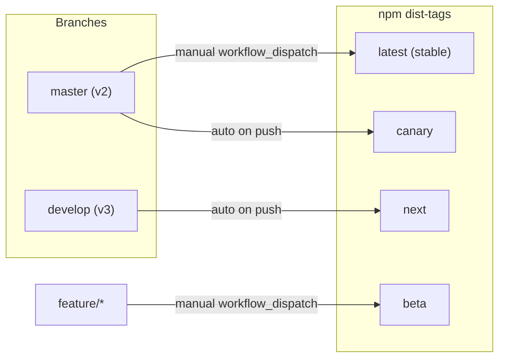
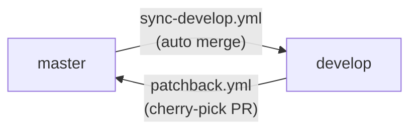
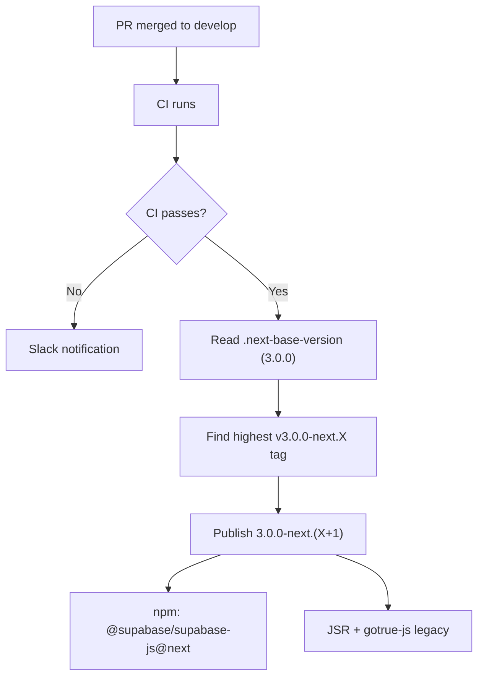
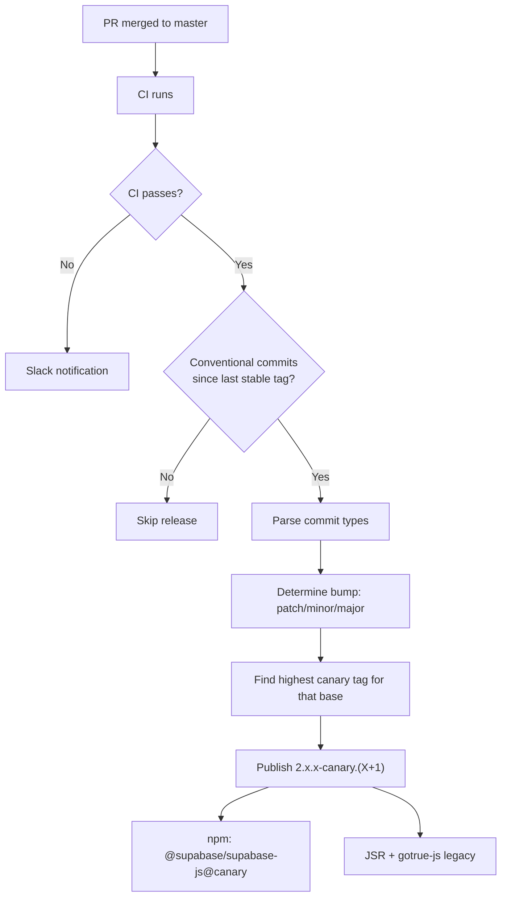
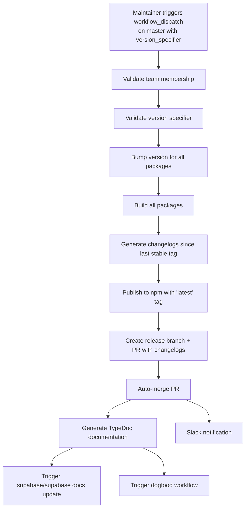
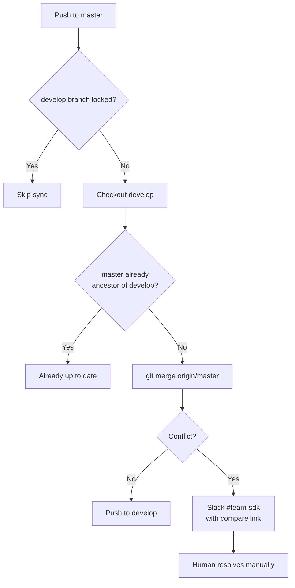
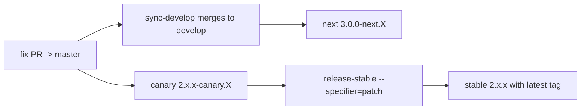
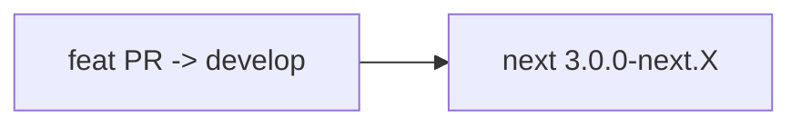
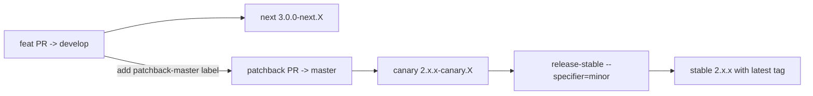

# Release Workflows

## Branch Model

This repo uses a two-branch model to support parallel v2 maintenance and v3 development:

| Branch    | Role                           | Default? | PR target for                     |
| --------- | ------------------------------ | -------- | --------------------------------- |
| `develop` | v3 features, next prereleases  | Yes      | Features (`feat:`)                |
| `master`  | v2 stable + canary prereleases | No       | Fixes (`fix:`), chores (`chore:`) |



### How branches stay in sync

Fixes merged to `master` are automatically merged into `develop` by the `sync-develop.yml` workflow (triggered on every push to `master`). This keeps v3 development up to date with all v2 fixes.

Features on `develop` that also need to ship as a v2 release can be cherry-picked to `master` using the **patchback** workflow (label a merged PR with `patchback-master`).



---

## Release Types

All packages share a single version number (fixed versioning) and are released together.

| Type        | Trigger     | Branch      | npm tag  | Version format   | Script              |
| ----------- | ----------- | ----------- | -------- | ---------------- | ------------------- |
| **Next**    | Auto (push) | `develop`   | `next`   | `3.0.0-next.X`   | `release-canary.ts` |
| **Canary**  | Auto (push) | `master`    | `canary` | `2.x.x-canary.X` | `release-canary.ts` |
| **Stable**  | Manual      | `master`    | `latest` | `2.x.x`          | `release-stable.ts` |
| **Beta**    | Manual      | `feature/*` | `beta`   | `x.x.x-beta.X`   | `release-beta.ts`   |
| **Preview** | Label on PR | any         | -        | -                | pkg.pr.new          |

---

## Automatic Releases

### Next Prereleases (from `develop`)

**Workflow:** `publish.yml`
**Trigger:** Every push to `develop` (after CI passes)



The base version for next prereleases is stored in **`.next-base-version`** at the repo root (currently `3.0.0`). The script always publishes — it does not check for conventional commits since every push to develop should produce a new prerelease.

```bash
# Install next prerelease
npm install @supabase/supabase-js@next
```

### Canary Prereleases (from `master`)

**Workflow:** `publish.yml`
**Trigger:** Every push to `master` (after CI passes)



Canary versions respect conventional commits:

| Commit type                  | Canary version             |
| ---------------------------- | -------------------------- |
| `fix:`                       | `2.104.1-canary.0` (patch) |
| `feat:`                      | `2.105.0-canary.0` (minor) |
| `feat!:` / `BREAKING CHANGE` | `3.0.0-canary.0` (major)   |

Canary releases are **skipped** if no conventional commits are detected since the last stable tag.

```bash
# Install canary
npm install @supabase/supabase-js@canary
```

---

## Manual Releases

### Stable Releases (from `master`)

**Workflow:** `publish.yml` (manual trigger)
**Script:** `scripts/release-stable.ts`
**Permission:** `@supabase/admin` or `@supabase/sdk` team members only



#### Version specifiers

**Keywords:** `patch`, `minor`, `major`, `prepatch`, `preminor`, `premajor`, `prerelease`

**Explicit:** `v2.105.0` or `2.105.0`

#### How to run

1. Go to **Actions** > **Publish releases** > **Run workflow**
2. Select `master` branch
3. Enter version specifier (e.g., `patch`)
4. Leave beta_version empty
5. Click **Run workflow**

### Beta Releases (from `feature/*` branches)

**Workflow:** `publish.yml` (manual trigger)
**Script:** `scripts/release-beta.ts`
**Permission:** `@supabase/admin` or `@supabase/sdk` team members only

Use beta releases to test features on a branch before merging. Each beta changelog is cumulative from the last stable tag.

#### How to run

1. Go to **Actions** > **Publish releases** > **Run workflow**
2. Select your **feature branch**
3. Enter beta version (e.g., `2.105.0-beta.0`)
4. Leave version_specifier empty
5. Click **Run workflow**

```bash
# Install beta
npm install @supabase/supabase-js@beta
```

### Preview Releases (PR-based)

**Workflow:** `preview-release.yml`
**Trigger:** PR with `trigger: preview` label

1. Contributor asks maintainer to add the `trigger: preview` label
2. Workflow builds affected packages and publishes via [pkg.pr.new](https://pkg.pr.new)
3. Automated comment with install instructions appears on the PR

```bash
npm install https://pkg.pr.new/@supabase/supabase-js@[pr-number]
```

---

## Branch Sync Workflows

### sync-develop.yml (master -> develop)

Keeps `develop` up to date with v2 fixes merged to `master`.

**Trigger:** Every push to `master` + manual `workflow_dispatch`



The branch-lock check prevents interference with in-progress releases. The workflow uses a GitHub App token to push directly to the protected `develop` branch.

### patchback.yml (develop -> master)

Cherry-picks merged PRs from `develop` to `master` when labeled `patchback-master`.

**Trigger:** PR on `develop` closed (merged) or labeled, with `patchback-master` label


---

## Day-to-Day Scenarios

### v2 bug fix



1. Open fix PR targeting `master`
2. Review + merge
3. Canary auto-publishes from master
4. sync-develop brings fix into develop (next prerelease auto-publishes)
5. When ready: trigger stable release with `patch`

### v3 feature



1. Open feature PR targeting `develop` (default)
2. Review + merge
3. Next prerelease auto-publishes for dogfooding
4. No effect on master or v2 releases

### v3 feature that also ships as v2 minor



1. Feature PR merged to `develop` (next prerelease publishes)
2. Add `patchback-master` label to the merged PR
3. Patchback workflow opens cherry-pick PR to `master`
4. Review + merge patchback PR
5. Canary auto-publishes from master
6. Trigger stable release with `minor`

### Emergency v2 fix

1. Open fix PR directly to `master`
2. Merge (canary auto-publishes)
3. Immediately trigger stable release with `patch`
4. sync-develop brings fix into develop automatically

### v3 ships

1. Open PR `develop` -> `master` (merge commit, not squash)
2. Review + merge
3. Trigger stable release with `major` -> publishes `3.0.0` with `latest`
4. Update `.next-base-version` for whatever comes next

---

## Configuration

### `.next-base-version`

A single-line file at the repo root containing the base version for next prereleases (currently `3.0.0`). Read by `publish.yml` when publishing from `develop`.

### Release scripts

| Script                      | Purpose                                                                                                                   |
| --------------------------- | ------------------------------------------------------------------------------------------------------------------------- |
| `scripts/release-canary.ts` | Handles both canary (master) and next (develop) prereleases. Accepts optional `--base-version`, `--preid`, `--tag` flags. |
| `scripts/release-stable.ts` | Handles stable releases. Creates release branch, changelog PR, publishes with `latest` tag.                               |
| `scripts/release-beta.ts`   | Handles beta releases from feature branches. Requires explicit version.                                                   |
| `scripts/utils.ts`          | Shared helpers: `getLastStableTag()` finds latest stable semver tag, `getArg()` parses CLI flags.                         |

### Workflow files

| Workflow              | Trigger                                          | Purpose                                           |
| --------------------- | ------------------------------------------------ | ------------------------------------------------- |
| `publish.yml`         | Push to `develop`/`master` + `workflow_dispatch` | CI, canary/next prereleases, stable/beta releases |
| `sync-develop.yml`    | Push to `master` + `workflow_dispatch`           | Merges master into develop                        |
| `patchback.yml`       | PR closed/labeled on `develop`                   | Cherry-picks to master                            |
| `preview-release.yml` | PR with `trigger: preview` label                 | PR preview packages                               |
| `ci.yml`              | Pull requests                                    | CI for PRs (calls ci-core + ci-supabase-js)       |

---

## npm Dist-Tags Summary

| Tag      | Source branch | Version format   | Trigger      | Install                              |
| -------- | ------------- | ---------------- | ------------ | ------------------------------------ |
| `next`   | `develop`     | `3.0.0-next.X`   | Auto on push | `npm i @supabase/supabase-js@next`   |
| `canary` | `master`      | `2.x.x-canary.X` | Auto on push | `npm i @supabase/supabase-js@canary` |
| `latest` | `master`      | `2.x.x`          | Manual       | `npm i @supabase/supabase-js@latest` |
| `beta`   | `feature/*`   | `x.x.x-beta.X`   | Manual       | `npm i @supabase/supabase-js@beta`   |

---

## Permissions & Security

- Canary and next releases use a **GitHub App token** for automation (tagging, pushing)
- Stable and beta releases are restricted to **`@supabase/admin` or `@supabase/sdk`** team members
- npm publishing uses **OIDC trusted publishing** (provenance)
- The GitHub App must be a **bypass actor** in branch protection for both `develop` and `master` (for sync-develop pushes, release branch creation)
- Slack notifications go to **`#team-sdk`** on sync/patchback failures and release failures/successes

---

## Best Practices

### For contributors

1. **Target the right branch**: features -> `develop`, fixes/chores -> `master`
2. **Use conventional commits** with scope: `fix(auth):`, `feat(realtime):`, `chore(repo):`
3. **Request preview releases** for complex PRs by asking for the `trigger: preview` label

### For maintainers

1. **v2 patch release**: merge fix to master, verify canary, trigger stable with `patch`
2. **v2 minor release**: patchback features from develop to master, trigger stable with `minor`
3. **Patchback**: add `patchback-master` label to any merged develop PR that should also ship in v2
4. **Monitor sync-develop**: if Slack reports a conflict, resolve it promptly to keep develop current
5. **Beta workflow**: use feature branches + beta releases for experimental work that isn't ready for develop yet

### For emergency releases

1. Open fix PR directly to `master` (bypass develop)
2. Merge (canary auto-publishes for immediate testing)
3. Trigger stable release with `patch`
4. sync-develop brings the fix to develop automatically
