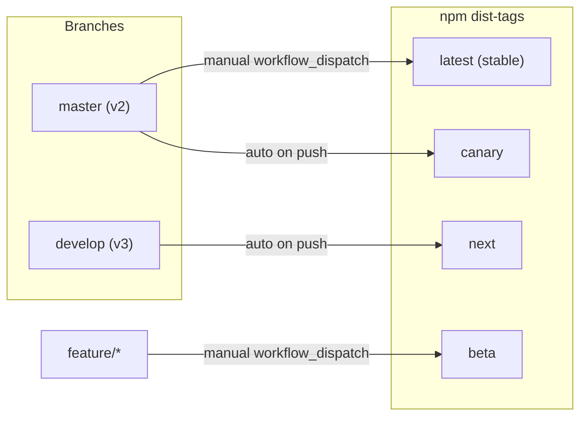
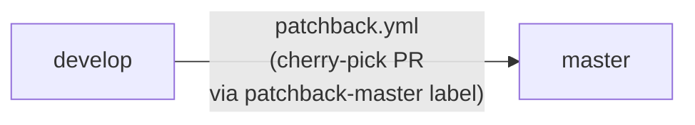
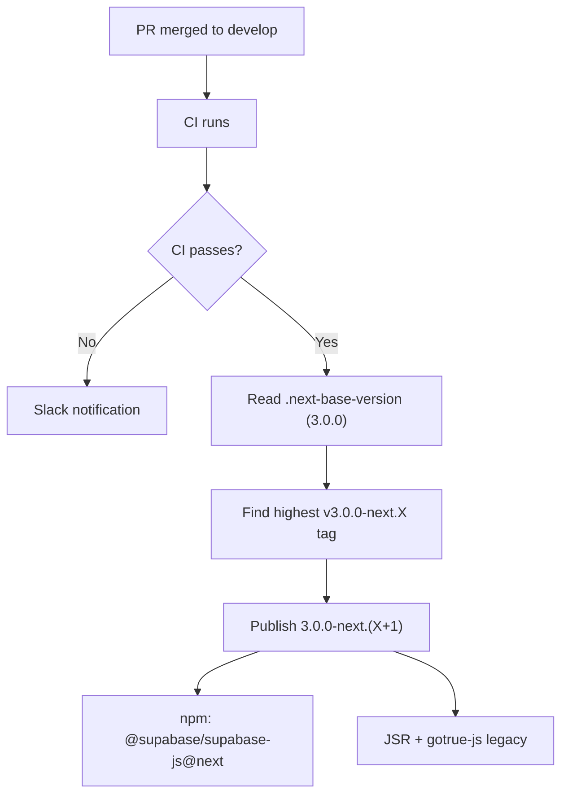
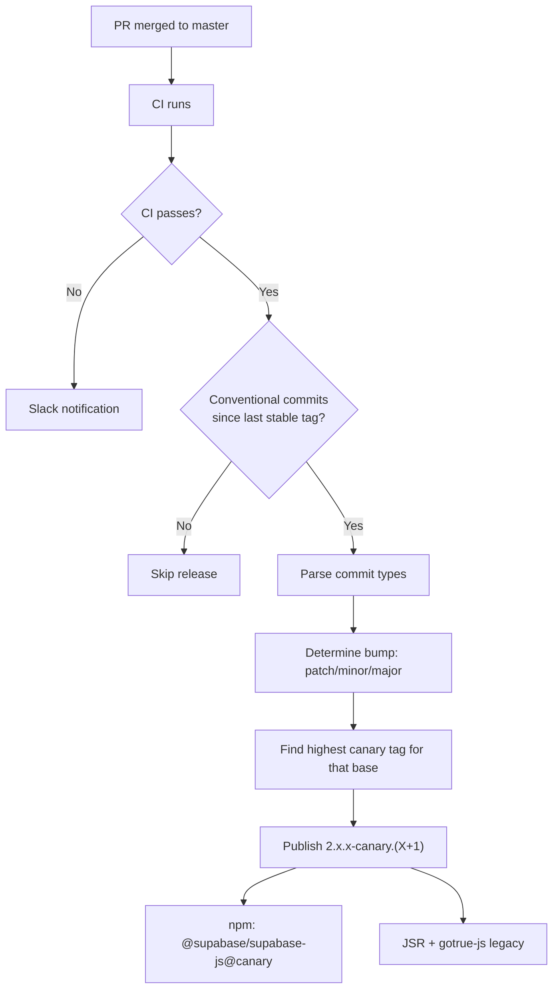
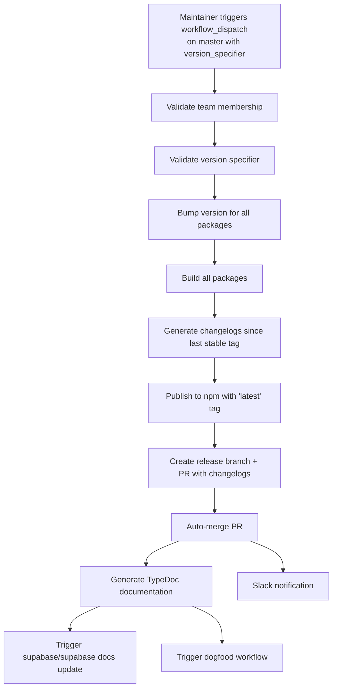
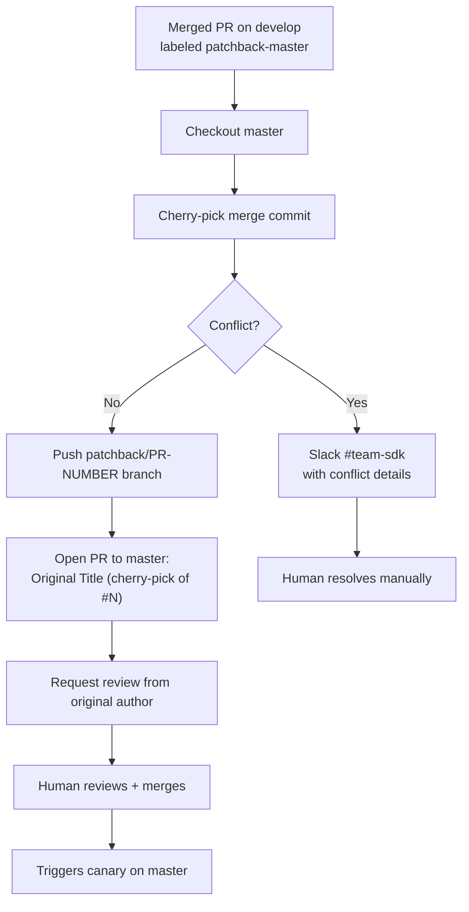
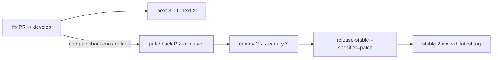
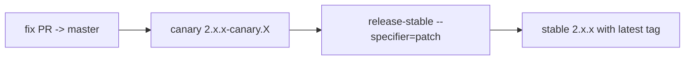
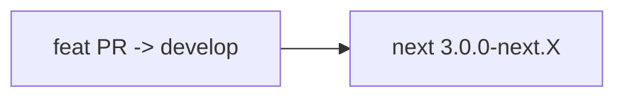
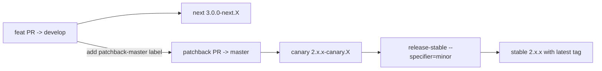

# Release Workflows

**TL;DR:** Two branches — `develop` (default, all PRs land here, publishes `@next`) and `master` (v2 maintenance, publishes `@canary` and `@latest`). Fixes that apply to both v2 and v3 land on `develop`, then cherry-pick to `master` via the `patchback-master` label. Only v2-only fixes (code already removed in v3) go directly to `master`. Stable releases are manual from master.

---

## Branch Model

This repo uses a two-branch model to support parallel v2 maintenance and v3 development:

| Branch    | Role                                | Default? | PR target for                                   |
| --------- | ----------------------------------- | -------- | ----------------------------------------------- |
| `develop` | v3 active development, `@next`      | Yes      | All work (features, fixes, chores) by default   |
| `master`  | v2 maintenance, `@canary`/`@latest` | No       | v2-only fixes; receives patchbacks from develop |

> **Default flow:** All PRs target `develop`. Changes that should also ship in v2 (most non-breaking fixes, selected non-breaking features) get the `patchback-master` label, which cherry-picks them to `master`. Only fixes for code that no longer exists on `develop` go directly to `master`. Breaking changes (`feat!:`, `fix!:`) stay on `develop` until v3 ships.



### How branches stay in sync

Flow is **unidirectional**: `develop` is canonical and all PRs land there. When a change also needs to ship in v2, label the merged develop PR with `patchback-master` and the **patchback** workflow opens a cherry-pick PR against `master`. v2-only changes (touching code that no longer exists on develop) land directly on `master` with no propagation back to develop.



---

## Release Types

All packages share a single version number (fixed versioning) and are released together.

| Type        | Trigger     | Branch      | npm tag  | Version format   | Script              |
| ----------- | ----------- | ----------- | -------- | ---------------- | ------------------- |
| **Next**    | Auto (push) | `develop`   | `next`   | `3.0.0-next.X`   | `release-canary.ts` |
| **Canary**  | Auto (push) | `master`    | `canary` | `2.x.x-canary.X` | `release-canary.ts` |
| **Stable**  | Manual      | `master`    | `latest` | `2.x.x`          | `release-stable.ts` |
| **Beta**    | Manual      | `feature/*` | `beta`   | `x.x.x-beta.X`   | `release-beta.ts`   |
| **Preview** | Auto (PR)   | any         | -        | -                | pkg.pr.new          |

---

## Automatic Releases

### Next Prereleases (from `develop`)

**Workflow:** `publish.yml`
**Trigger:** Every push to `develop` (after CI passes)



The base version for next prereleases is stored in **`.next-base-version`** at the repo root (currently `3.0.0`). The script always publishes — it does not check for conventional commits since every push to develop should produce a new prerelease.

```bash
# Install next prerelease
npm install @supabase/supabase-js@next
```

### Canary Prereleases (from `master`)

**Workflow:** `publish.yml`
**Trigger:** Every push to `master` (after CI passes)



Canary versions respect conventional commits:

| Commit type                  | Canary version             |
| ---------------------------- | -------------------------- |
| `fix:`                       | `2.104.1-canary.0` (patch) |
| `feat:`                      | `2.105.0-canary.0` (minor) |
| `feat!:` / `BREAKING CHANGE` | `3.0.0-canary.0` (major)   |

Canary releases are **skipped** if no conventional commits are detected since the last stable tag.

```bash
# Install canary
npm install @supabase/supabase-js@canary
```

---

## Manual Releases

### Stable Releases (from `master`)

**Workflow:** `publish.yml` (manual trigger)
**Script:** `scripts/release-stable.ts`
**Permission:** `@supabase/admin` or `@supabase/sdk` team members only



#### Version specifiers

**Keywords:** `patch`, `minor`, `major`, `prepatch`, `preminor`, `premajor`, `prerelease`

**Explicit:** `v2.105.0` or `2.105.0`

#### How to run

1. Go to **Actions** > **Publish releases** > **Run workflow**
2. Select `master` branch
3. Enter version specifier (e.g., `patch`)
4. Leave beta_version empty
5. Click **Run workflow**

### Beta Releases (from `feature/*` branches)

**Workflow:** `publish.yml` (manual trigger)
**Script:** `scripts/release-beta.ts`
**Permission:** `@supabase/admin` or `@supabase/sdk` team members only

Use beta releases to test features on a branch before merging. Each beta changelog is cumulative from the last stable tag.

#### How to run

1. Go to **Actions** > **Publish releases** > **Run workflow**
2. Select your **feature branch**
3. Enter beta version (e.g., `2.105.0-beta.0`)
4. Leave version_specifier empty
5. Click **Run workflow**

```bash
# Install beta
npm install @supabase/supabase-js@beta
```

### Preview Releases (PR-based)

**Workflow:** `preview-release.yml`
**Trigger:** Every PR that touches package code (automatic, no label needed)

1. PR is opened or updated with changes to `packages/core/**`
2. Workflow builds all packages and publishes via [pkg.pr.new](https://pkg.pr.new)
3. Integration tests run against the preview packages

```bash
npm install https://pkg.pr.new/@supabase/supabase-js@[commit-hash]
```

---

## Branch Sync Workflow

### patchback.yml (develop -> master)

Cherry-picks merged PRs from `develop` to `master` when labeled `patchback-master`. This is the only cross-branch flow — `master` does not propagate back to `develop`.

**Trigger:** PR on `develop` closed (merged) or labeled, with `patchback-master` label



---

## Day-to-Day Scenarios

### Bug fix that applies to both v2 and v3 (default)



1. Open fix PR targeting `develop` (default)
2. Review + merge — next prerelease auto-publishes
3. Add `patchback-master` label → patchback opens cherry-pick PR to `master`
4. Review + merge the patchback PR — canary auto-publishes
5. When ready: trigger stable release with `patch`

### v2-only bug fix

Use only when the affected code no longer exists on `develop`.



1. Open fix PR targeting `master`
2. Review + merge
3. Canary auto-publishes from master
4. When ready: trigger stable release with `patch`

### v3 feature



1. Open feature PR targeting `develop` (default)
2. Review + merge
3. Next prerelease auto-publishes for dogfooding
4. No effect on master or v2 releases

### v3 feature that also ships as v2 minor



1. Feature PR merged to `develop` (next prerelease publishes)
2. Reviewer/maintainer adds the **`v2-minor`** label as a staging marker (bookkeeping only, no automation)
3. On the next batch day (see [Release cadence](#release-cadence)), a maintainer applies `patchback-master` to each `v2-minor`-labeled merged PR
4. Patchback workflow opens one cherry-pick PR per labeled PR against `master`
5. Review + merge each patchback PR (canary auto-publishes per merge)
6. Once all patchbacks are merged and the last canary is green, trigger stable release with `minor` — one stable covering the whole batch

### Release cadence

To keep v2 releases predictable:

- **Patches** (v2 fixes on `master`): any weekday Mon–Fri, as fixes land
- **Minor** (v2 feats batched via patchback): **Monday primary**, **Wednesday fallback** if enough features accumulated since Monday. **Never Thursday or Friday.**
- **Major**: only when v3 ships

The `v2-minor` label is the week-long staging marker; `patchback-master` is applied in batch on the release day. See the [SDK deployment playbook](https://github.com/supabase/playbooks/blob/main/playbooks/client-libs/deployment-playbook.md) for the full operational routine.

### Emergency v2 fix

1. Open fix PR directly to `master`
2. Merge (canary auto-publishes)
3. Immediately trigger stable release with `patch`
4. If the bug also exists on `develop`, open a follow-up fix PR there (no auto-propagation)

### v3 ships

1. Open PR `develop` -> `master` (merge commit, not squash)
2. Review + merge
3. Trigger stable release with `major` -> publishes `3.0.0` with `latest`
4. Update `.next-base-version` for whatever comes next

---

## Configuration

- **`.next-base-version`** — contains `3.0.0`, read by `publish.yml` for next prereleases from `develop`
- **`scripts/release-canary.ts`** — handles both canary and next prereleases (optional `--base-version`, `--preid`, `--tag` flags)
- **`scripts/release-stable.ts`** — stable releases, creates changelog PR
- **`scripts/release-beta.ts`** — beta releases from feature branches

---

## Permissions & Security

- Automated releases (canary, next) and the patchback workflow use a **GitHub App token** — the app must be a **bypass actor** in branch protection for `develop` and `master`
- Manual releases (stable, beta) are restricted to **`@supabase/admin`** or **`@supabase/sdk`** team members
- npm publishing uses **OIDC trusted publishing** (provenance)
- Slack notifications go to **`#team-sdk`** on failures

---

## Best Practices

### For contributors

1. **Target `develop` by default** — features, fixes, and chores all land there. Only target `master` when fixing v2-only code that no longer exists on develop.
2. **Use conventional commits** with scope: `fix(auth):`, `feat(realtime):`, `chore(repo):`
3. **Preview releases** are automatic on every PR that touches package code

### For maintainers

1. **v2 patch release**: for fixes that apply to both v2 and v3, label the merged develop PR with `patchback-master`, merge the patchback PR on master, verify canary, trigger stable with `patch` (any weekday). For v2-only fixes, merge directly to master and trigger stable.
2. **v2 minor release**: batch-apply `patchback-master` to all `v2-minor`-labeled develop PRs on Monday (or Wednesday), merge patchback PRs, then trigger stable with `minor` once — see [Release cadence](#release-cadence)
3. **Staging label**: apply `v2-minor` at merge time to any non-breaking develop feat PR that should also ship in v2
4. **Monitor patchback**: Slack alerts on cherry-pick conflict. If trivial, resolve same day. If not, drop from this week's minor and defer
5. **Beta workflow**: use feature branches + beta releases for experimental work that isn't ready for develop yet

### For emergency releases

1. Open fix PR directly to `master` (bypass develop)
2. Merge (canary auto-publishes for immediate testing)
3. Trigger stable release with `patch`
4. If the bug also exists on develop, open a separate fix PR there (no auto-propagation)
