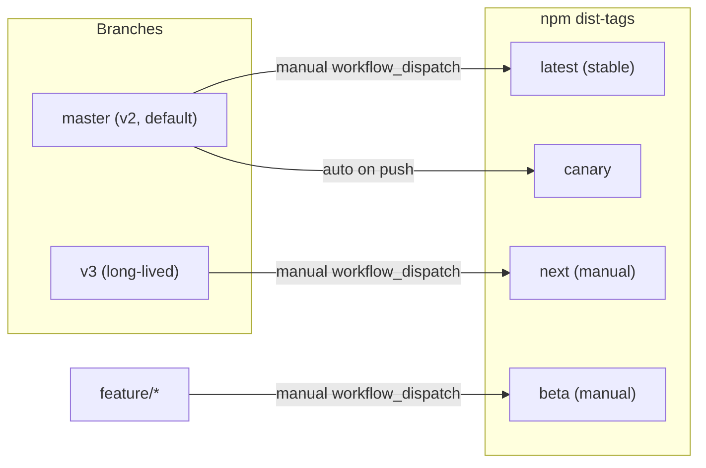
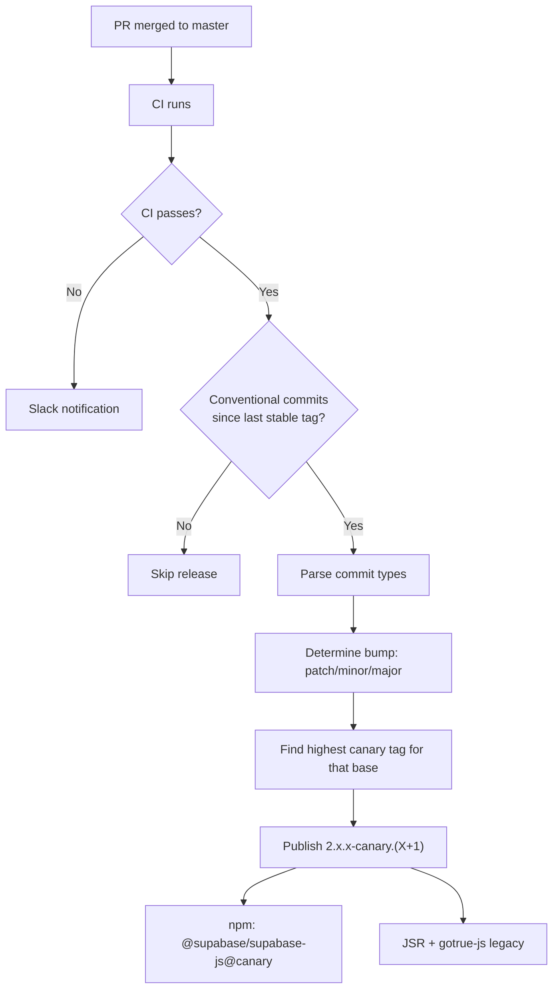
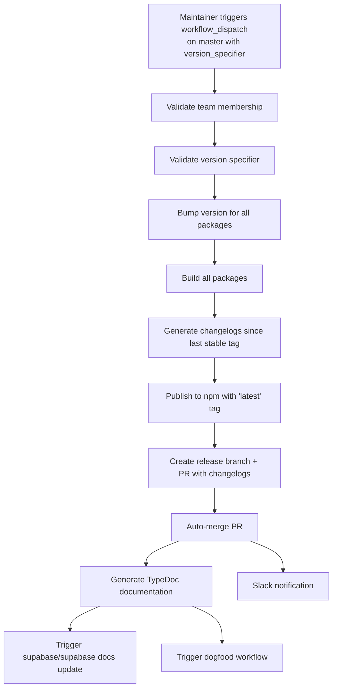
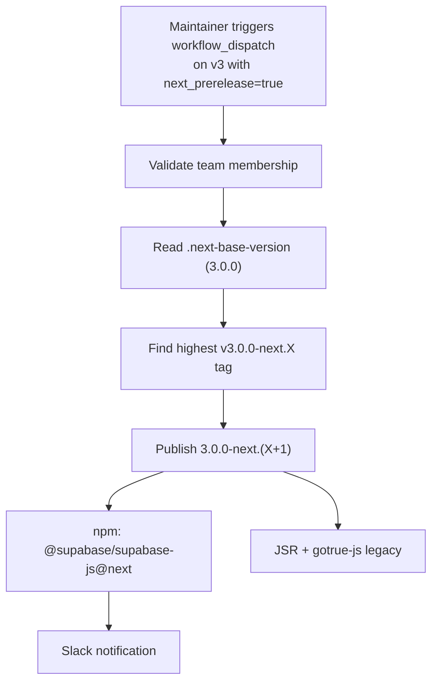
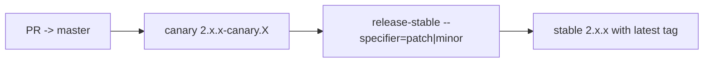
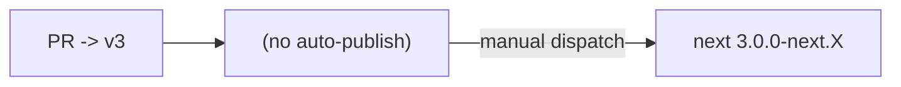

# Release Workflows

**TL;DR:** `master` is the default branch — all PRs land here, every push auto-publishes a `@canary` prerelease, and stable releases are manually promoted from master. `v3` is a long-lived feature branch where v3-only (breaking) work lives; v3 next prereleases (`@next`) are **manual-only** via `workflow_dispatch`. v3 stays in sync with master by periodically merging master into v3.

---

## Branch Model

| Branch   | Role                                       | Default? | PR target for                         |
| -------- | ------------------------------------------ | -------- | ------------------------------------- |
| `master` | v2 active development, `@canary`/`@latest` | Yes      | All work (features, fixes, chores)    |
| `v3`     | v3 breaking changes, `@next` (manual only) | No       | v3-only breaking changes; v3 backport |

> **Default flow:** All PRs target `master`. Non-breaking work ships on the v2 line. v3-only breaking changes target `v3` directly (or a short-lived `v3-*` working branch that PRs into `v3`). v3 is kept in sync by periodically merging `master` into `v3` (manual, on cadence).



### How `v3` stays in sync with `master`

Manual merge on cadence (suggested: weekly, or before each v3 prerelease cut):

```bash
git switch v3 && git pull --ff-only
git merge master   # merge commit, NOT rebase — preserves v3-* sub-branches
# resolve conflicts (favor v3 for the breaking-change code paths)
git push origin v3
```

`git cherry origin/master origin/v3` will tell you what's diverged whenever you want to sanity-check.

---

## Release Types

All packages share a single version number (fixed versioning) and are released together.

| Type        | Trigger     | Branch      | npm tag  | Version format   | Script              |
| ----------- | ----------- | ----------- | -------- | ---------------- | ------------------- |
| **Canary**  | Auto (push) | `master`    | `canary` | `2.x.x-canary.X` | `release-canary.ts` |
| **Stable**  | Manual      | `master`    | `latest` | `2.x.x`          | `release-stable.ts` |
| **Next**    | Manual      | `v3`        | `next`   | `3.0.0-next.X`   | `release-canary.ts` |
| **Beta**    | Manual      | `feature/*` | `beta`   | `x.x.x-beta.X`   | `release-beta.ts`   |
| **Preview** | Auto (PR)   | any         | -        | -                | pkg.pr.new          |

---

## Automatic Releases

### Canary Prereleases (from `master`)

**Workflow:** `publish.yml`
**Trigger:** Every push to `master` (after CI passes)



Canary versions respect conventional commits:

| Commit type                  | Canary version             |
| ---------------------------- | -------------------------- |
| `fix:`                       | `2.104.1-canary.0` (patch) |
| `feat:`                      | `2.105.0-canary.0` (minor) |
| `feat!:` / `BREAKING CHANGE` | `3.0.0-canary.0` (major)   |

Canary releases are **skipped** if no conventional commits are detected since the last stable tag.

```bash
# Install canary
npm install @supabase/supabase-js@canary
```

---

## Manual Releases

### Stable Releases (from `master`)

**Workflow:** `publish.yml` (manual trigger)
**Script:** `scripts/release-stable.ts`
**Permission:** `@supabase/admin` or `@supabase/sdk` team members only



#### Version specifiers

**Keywords:** `patch`, `minor`, `major`, `prepatch`, `preminor`, `premajor`, `prerelease`

**Explicit:** `v2.105.0` or `2.105.0`

#### How to run

1. Go to **Actions** > **Publish releases** > **Run workflow**
2. Select `master` branch
3. Enter version specifier (e.g., `patch`)
4. Leave `beta_version` empty and `next_prerelease` unchecked
5. Click **Run workflow**

### Next Prereleases (from `v3`)

**Workflow:** `publish.yml` (manual trigger)
**Script:** `scripts/release-canary.ts` (with `--base-version`, `--preid`, `--tag` flags)
**Permission:** `@supabase/admin` or `@supabase/sdk` team members only

v3 next prereleases are **manual-only** — there is no auto-publish on push to `v3`. This keeps `v3` flexible for in-flight work without burning npm versions on every commit. The base version is read from **`.next-base-version`** at the repo root (currently `3.0.0`); the script picks the next `-next.X` suffix automatically.



The GitHub release is auto-marked as a prerelease (nx detects the `-next.X` semver identifier). npm dist-tag is `next`, **not** `latest` — `npm install @supabase/supabase-js` (which defaults to `@latest`) keeps pulling v2 stable.

#### How to run

1. Go to **Actions** > **Publish releases** > **Run workflow**
2. Select `v3` branch
3. Check **`next_prerelease`**
4. Leave `version_specifier` and `beta_version` empty
5. Click **Run workflow**

```bash
# Install next prerelease
npm install @supabase/supabase-js@next
```

### Beta Releases (from `feature/*` branches)

**Workflow:** `publish.yml` (manual trigger)
**Script:** `scripts/release-beta.ts`
**Permission:** `@supabase/admin` or `@supabase/sdk` team members only

Use beta releases to test features on a branch before merging. Each beta changelog is cumulative from the last stable tag.

#### How to run

1. Go to **Actions** > **Publish releases** > **Run workflow**
2. Select your **feature branch**
3. Enter beta version (e.g., `2.105.0-beta.0`)
4. Leave `version_specifier` empty and `next_prerelease` unchecked
5. Click **Run workflow**

```bash
# Install beta
npm install @supabase/supabase-js@beta
```

### Preview Releases (PR-based)

**Workflow:** `preview-release.yml`
**Trigger:** Every PR that touches package code (automatic, no label needed)

1. PR is opened or updated with changes to `packages/core/**`
2. Workflow builds all packages and publishes via [pkg.pr.new](https://pkg.pr.new)
3. Integration tests run against the preview packages

```bash
npm install https://pkg.pr.new/@supabase/supabase-js@[commit-hash]
```

---

## Day-to-Day Scenarios

### Non-breaking fix or feature (default)



1. Open PR targeting `master` (default)
2. Review + merge — canary auto-publishes
3. When ready: trigger stable release with `patch` or `minor`
4. (Optional) merge `master` into `v3` to bring the change forward

### v3-only breaking change



1. Open PR targeting `v3` (or a `v3-*` working branch that PRs into v3)
2. Review + merge — **no auto-publish**
3. When you want a dogfooding prerelease, manually trigger `publish.yml` with `next_prerelease=true` on the `v3` branch

### Emergency v2 fix

1. Open fix PR directly to `master`
2. Merge (canary auto-publishes for immediate testing)
3. Trigger stable release with `patch`
4. (Optional) merge `master` into `v3` afterwards so v3 inherits the fix

### v3 ships

1. Open PR `v3` -> `master` (merge commit, not squash)
2. Review + merge
3. Trigger stable release with `major` -> publishes `3.0.0` with `latest`
4. Update `.next-base-version` to whatever comes next (e.g., `4.0.0`) if applicable

---

## Configuration

- **`.next-base-version`** — contains `3.0.0`, read by `publish.yml` for v3 next prereleases
- **`scripts/release-canary.ts`** — handles both canary (default) and next prereleases via optional `--base-version`, `--preid`, `--tag` flags
- **`scripts/release-stable.ts`** — stable releases, creates changelog PR
- **`scripts/release-beta.ts`** — beta releases from feature branches

---

## Permissions & Security

- Automated canary releases use a **GitHub App token** — the app must be a **bypass actor** in branch protection for `master`
- Manual releases (stable, next, beta) are restricted to **`@supabase/admin`** or **`@supabase/sdk`** team members
- npm publishing uses **OIDC trusted publishing** (provenance) via a single workflow file (`publish.yml`)
- Slack notifications go to **`#team-sdk`** on failures

---

## Best Practices

### For contributors

1. **Target `master` by default** — features, fixes, and chores all land there. Only target `v3` for v3-only breaking changes.
2. **Use conventional commits** with scope: `fix(auth):`, `feat(realtime):`, `chore(repo):`. Breaking changes use `!` (e.g. `fix(storage)!:`) or a `BREAKING CHANGE:` footer.
3. **Preview releases** are automatic on every PR that touches package code.

### For maintainers

1. **v2 patch / minor release**: merge fixes / non-breaking features to `master`, verify canary, trigger stable with `patch` or `minor`.
2. **v3 prerelease**: from `v3`, trigger `publish.yml` with `next_prerelease=true` whenever a dogfooding build is needed.
3. **Keep v3 in sync**: periodically (weekly recommended), merge `master` into `v3`. Use a merge commit, not rebase, to preserve any `v3-*` sub-branches.
4. **Beta workflow**: use feature branches + beta releases for experimental work that isn't ready for `master`.

### For emergency releases

1. Open fix PR directly to `master`
2. Merge (canary auto-publishes for immediate testing)
3. Trigger stable release with `patch`
4. Merge `master` into `v3` so the fix carries forward
